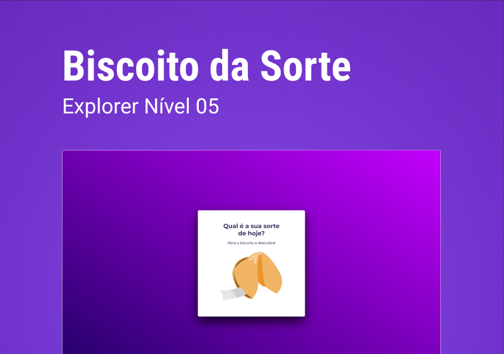

# <h1 align="center">Fortune Cookie</h1>

 Extra Challenge - Stage 05 - RocketSeat Explorer.

 Click on the fortune cookie to open a message. 

 <a href="#-Worked-concepts">Worked Concepts</a>&nbsp;&nbsp;&nbsp;|&nbsp;&nbsp;&nbsp;
  <a href="#-Technologies">Technologies</a>&nbsp;&nbsp;&nbsp;|&nbsp;&nbsp;&nbsp;
  <a href="#-Project-Demonstration">Project Demonstration</a>&nbsp;&nbsp;&nbsp;|&nbsp;&nbsp;&nbsp;
  <a href="#-License">License</a>

  

## 📝 Worked Concepts

- HTML data structure
- CSS animations
- Javascript Functions
- DOM Manipulation
- JS Math()
- Callback functions
- Arrays

## 🚀 Technologies

- HTML e CSS
- JavaScript
- Git e Github
- Figma

## 💻 Project Demonstration

  

## 📝 License

  

 
